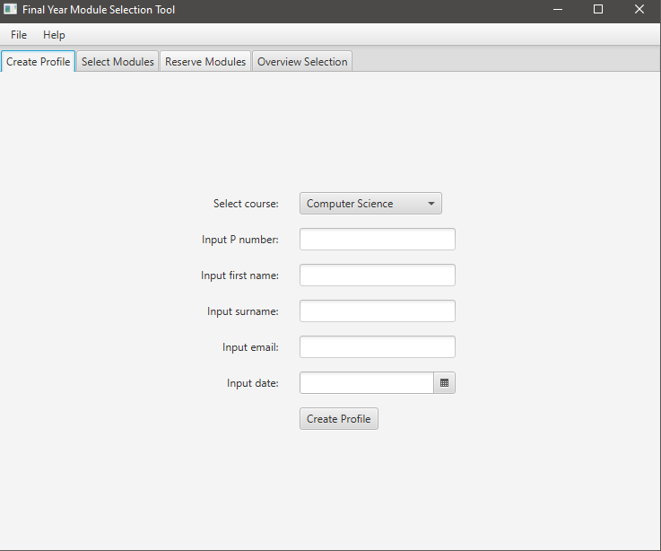

University Final Year Module Chooser

A Java program developed using JavaFX GUI plugin.

The program allows users to create a profile. 
Once the profile is created the user can select term 1 and term 2 modules they would like to study for the next year. There is also a reserve module feature incase their main choices are not available.
The user has an set number of credits for each term they have to fufill in order to proceed.
After that, the user is able to see an overview of their data, with a button that exports the data onto a text file in the directory of the project. 

